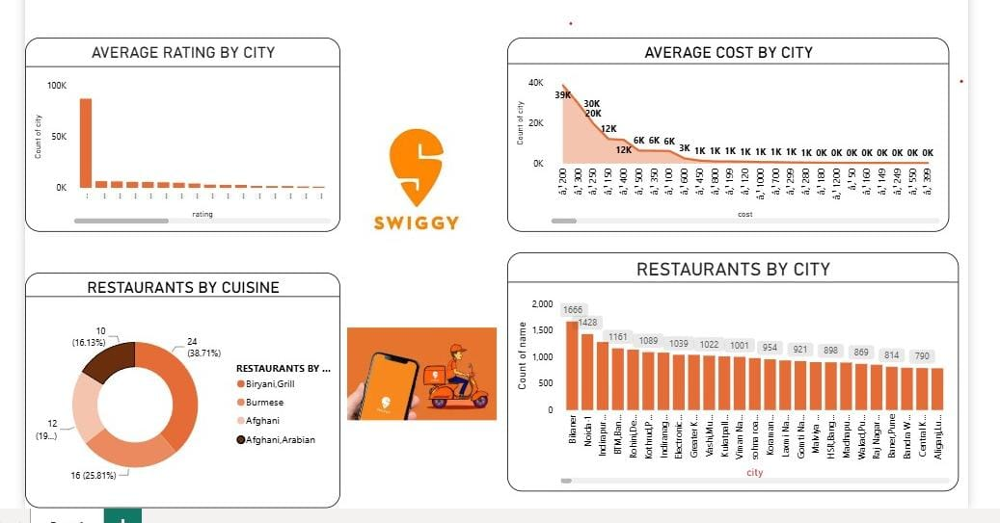

 Swiggy Restaurant Analysis Dashboard | Power BI

Project Overview

This project is an interactive Swiggy Restaurant Analysis Dashboard developed using Microsoft Power BI.

The dashboard analyzes restaurant data based on city, cuisine, rating, and cost, providing meaningful insights through interactive visualizations.

Dashboard Preview

 Project Objectives

Analyze the number of restaurants across different cities

Compare average restaurant ratings by city

Analyze average restaurant cost

Understand restaurant distribution by cuisine

Identify key patterns and trends in restaurant data

Create an interactive and user-friendly dashboard

 Dashboard Features

 Restaurant Analysis

Restaurants by City

City-wise Restaurant Count

Top Cities by Restaurant Availability

 Rating Analysis

Average Rating by City

Rating Distribution

Comparison of restaurant ratings

 Cost Analysis

Average Cost by City

Cost Distribution

City-wise Cost Comparison

Cuisine Analysis

Restaurants by Cuisine

Cuisine-wise Restaurant Distribution

Comparison of popular cuisines

 Tools & Technologies

Microsoft Power BI

Power Query

DAX

Data Cleaning & Transformation

Data Modeling

Data Visualization

 Key Insights

The dashboard provides insights into:

Restaurant availability across different cities

Average ratings across cities

Average restaurant cost

Distribution of restaurants by cuisine

Cities with higher restaurant counts

Popular cuisine categories

 Dashboard Preview

Add the Power BI dashboard screenshot here.

Swiggy-Dashboard.png

 Project Structure

Swiggy-Restaurant-Analysis/
│
├── Swiggy-Restaurant-Analysis.pbix
├── Swiggy-Dashboard.png
└── README.md

 Learning Outcomes

Through this project, I strengthened my practical knowledge of:

Data Cleaning and Transformation

Power Query

DAX Calculations

Data Modeling

Interactive Dashboard Development

Data Visualization

Business Intelligence

This project is part of my Data Analytics and Power BI learning journey.

Future Enhancements

Add more detailed restaurant analysis

Include advanced DAX measures

Add additional interactive filters

Improve dashboard UI/UX

Add more city and cuisine-level insights

Author

Ponradha

This project was created as part of my journey to develop practical skills in Power BI and Data Analytics.

---

⭐ If you find this project useful, feel free to explore the repository and share your feedback!
